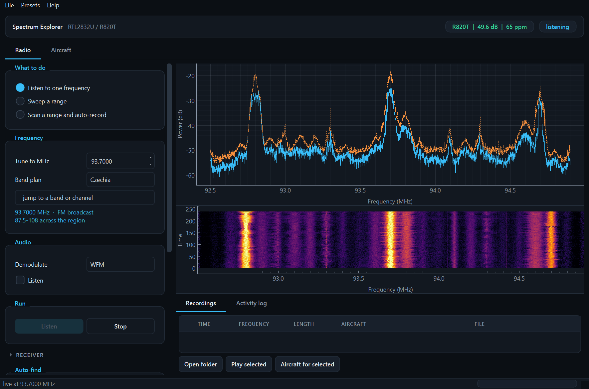
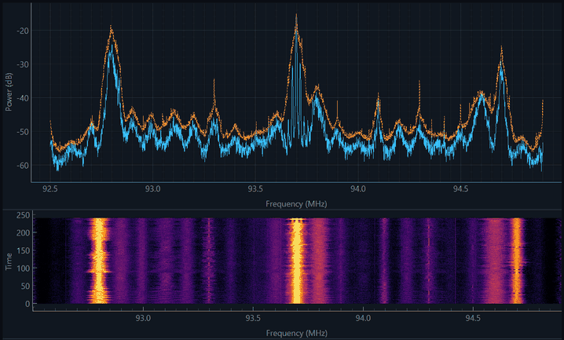

# rtl-spectrum

Drop in a dead DVB-T dongle, pick a frequency, press **Listen** — and get radio,
a spectrum, unattended voice recordings, or aircraft on a map.



Live FM broadcast band, peak hold on the trace and the waterfall running underneath:



Broadcasters moved to DVB-T2 and the cheap RTL2832U sticks stopped receiving
television. The DVB-T demodulator in them cannot be upgraded — that is a
different chip, not a firmware level — but the tuner still hands over raw IQ
from **24 MHz to 1.766 GHz**, which is a perfectly good wideband receiver.

## What it does

**Radio tab** — one frequency at a time, three things you can do to it:

1. **Listen** to one frequency (WFM / NFM / AM), record what you hear to WAV.
2. **Sweep** a range and stitch every slice into one wideband trace, with peak
   hold, CSV and PNG export. *Auto-find* estimates the noise floor blockwise and
   lists every carrier above it, named by band — double-click one to tune it.
3. **Scan** a range and auto-record. The scanner FFTs a whole 1.2 MHz slice and
   tests every 25 kHz channel in it at once, so a 19 MHz band sweeps in about a
   second. A channel that opens is tuned and recorded to a timestamped WAV until
   it goes quiet; anything shorter than a threshold is discarded.

**Aircraft tab** — ADS-B on 1090 MHz over a real slippy map. Aircraft broadcast
identity, altitude and position unencrypted for collision avoidance. Frames are
CRC-checked with the 25-bit Mode S polynomial before being believed, and the
surveillance replies (DF0/4/5/16/20/21) are recovered by address, which adds
squawk codes and fills in altitudes that DF17 alone misses.

```
~/rtlsdr-recordings/
  118.1000MHz_20260919_213044.wav     one squelch opening, one file
  121.5000MHz_20260919_213112.wav
```

## Install

Download the archive for your OS from
[Releases](https://github.com/hclivess/rtl-spectrum/releases), unpack, run
`rtl-spectrum`. No Python needed.

From source:

```
pip install -r requirements.txt
python main.py
```

### The two things that are not optional

**A WinUSB driver.** Use [Zadig](https://zadig.akeo.ie), tick
*Options → List All Devices*, select **`Bulk-In, Interface (Interface 0)`** — not
the composite parent — and install **WinUSB**. This replaces the TV-tuner driver;
the DVB-T side stops working, which costs you nothing.

**librtlsdr.** `rtlsdr.dll` plus `pthreadVC2.dll` and `msvcr100.dll` from the
[rtl-sdr-blog release](https://github.com/rtlsdrblog/rtl-sdr-blog/releases), and
`rtl_adsb` from the same archive for the Aircraft tab. Put them in `rtl/` beside
the app, or point the environment variables below at them.

| What | Environment variable | Fallbacks |
|---|---|---|
| `rtlsdr.dll` | `RTLSDR_DLL_DIR` | `./rtl`, the app directory |
| `rtl_adsb` | `RTL_ADSB` | `./rtl`, the app directory, `PATH` |
| recordings | `RTLSDR_REC_DIR` | `~/rtlsdr-recordings` |

## Settings

| Group | What matters |
|---|---|
| **What to do** | Listen / Sweep / Scan — the fields below change to match |
| **Frequency** | one frequency, or a range; a country band plan with named channels; the selected band is named beneath |
| **Audio** | WFM / NFM / AM, and Listen |
| **Scanner options** | channel step (**8.333 kHz** for European airband), squelch dB, hang time, discard-under, skip dongle spurs, output folder |
| **Receiver** | sample rate, gain, **ppm**, FFT size, peak hold, which dongle |
| **Auto-find** | scan the current range and list carriers with their band |
| **Record** | audio WAV, raw IQ, trace CSV, chart PNG |
| **Aircraft** | your position for range rings and distance, map source, dark basemap, which dongle |

### Band plans

24 countries across the three ITU regions. The selection drives frequency
labelling, the jump list and the automatic demodulator: FM is **76-95 MHz in
Japan**, licence-free UHF differs everywhere, and the UK warns that listening
beyond broadcast and amateur is an offence there.

The same dropdown carries **named channels** — pick one and it tunes straight
to it. The Czech entries (Praha ATIS, TOWER, GROUND, APPROACH and all fifteen
Praha Radar sector frequencies) and the licence-free VO-R allocations come
from [kmitocty.cz](https://www.kmitocty.cz/vzdusne-prostory-cr-a-komunikacni-frekvence/)
and its [list of general authorisations](https://www.kmitocty.cz/vseobecna-opravneni/).
The official source for Czech airspace is the
[VFR manual at aim.rlp.cz](https://aim.rlp.cz).

Start with an **ATIS**: it is a looped recording transmitting continuously, so
it tells you whether your antenna can hear the airband at all, which a sector
frequency that is merely quiet cannot.

Presets: four built-ins (FM radio, Airband scan + record, Whole-band survey,
Aircraft), plus save / load / delete / import / export and *save current as
defaults*. Saved presets are JSON in `presets/` beside the app.

## Tips — symptom to setting

| Symptom | What to change |
|---|---|
| Stations land a few kHz low | set **ppm**; an R820T is typically tens of ppm off. Measure against a known broadcast carrier |
| The scanner records a permanent, unmodulated carrier | leave **Skip dongle spurs** on. 120.000 MHz is 24 MHz × 5, generated inside the dongle |
| Airband hears nothing | the stock DVB-T whip is far too long for VHF airband; a quarter-wave is ~60 cm |
| Few aircraft, few positions | a 1090 MHz band-pass filter ahead of the dongle. The R820T front end is wide open, and local FM at kilowatts compresses it. Quarter-wave at 1090 is **6.9 cm** |
| Aircraft has altitude but no map position | a position needs an even/odd CPR pair within 10 s. Altitude and squawk still work |
| A distance shows red | the fix is beyond the radio horizon for that altitude, so it is a stale CPR pair, not a real position |
| Audio stutters | another program is using the CPU; the ring buffer holds 350 ms |

## Notes on the implementation

**Why not pyrtlsdr.** It binds `rtlsdr_set_dithering` at import, which the
rtl-sdr-blog Windows DLL does not export, so it raises before a device is
opened. `librtl.py` binds only what is needed.

**Streaming filters must be stateful.** An FFT filter applied per block is a
*circular* convolution: each block wraps its own edges and the joins click at
the block rate. `dsp.FirDecimator` carries the filter tail and convolves in
`valid` mode, which is genuinely linear. Measured seam discontinuity went from
0.0575 rad to 0.

**Reading and processing cannot share a thread.** `read_bytes` takes a whole
block period to return, so doing the FFTs between calls pushes each iteration
past the block time and librtlsdr silently drops the overflow — 26.93 ms read +
4.66 ms work against a 27.3 ms budget produced 80 % of real-time audio. A
dedicated reader thread and a ring buffer feeding PortAudio's own callback took
that to 99.7 % with no underruns.

**CPR positions are gated on time.** Global CPR is only unambiguous while the
even and odd frames describe nearly the same place. Pairing frames minutes
apart yields a confident-looking position that can be hundreds of kilometres
wrong, so pairs older than `AdsbDecoder.MAX_CPR_GAP` are rejected.

**Internal spurs look exactly like stations.** Harmonics of the 28.8 MHz
reference and the 24 MHz USB clock are strong, permanent and unmodulated. If a
carrier never modulates, suspect the dongle before the band.

**Map.** Web Mercator degrees, so tiles are axis-aligned squares and the aspect
lock is 1:1. Tiles come from key-free providers and are cached under
`data/tiles/`. Light basemaps are darkened by inverting *luminance* and
rescaling each channel by the same factor, so hues survive — a plain `255 - x`
turns greenery magenta. Without a network it falls back to bundled Natural Earth
outlines.

## Build

```
pip install -r requirements.txt
python build.py
```

PyInstaller onedir, `--noupx`, with a Windows version resource, producing
`dist/rtl-spectrum-<version>-<os>-<arch>` plus an archive and a `.sha256`.

Headless self-test, used by CI on the frozen binary:

```
RTLSPECTRUM_SELFTEST=out.wav ./rtl-spectrum
```

It synthesises an AM carrier, runs the real demodulator, writes a real WAV,
checks the tone came back within 20 Hz, and decodes a known-good ADS-B frame.
No dongle required; exit 0 only if actual output was produced.

## Changes in 1.0

- First release, built to the [hclivess house standard](https://github.com/hclivess/beautiful-software).
- Radio tab merges listening, sweeping and scanning: one frequency control,
  one demodulator, one Start. Everything not needed to press Start sits behind
  a disclosure.
- Band plans for 24 countries, with named channels per country.
- Recordings carry an aircraft sidecar (`<file>.wav.json`). With one dongle the
  two modes cannot run together, so it records the data's age; with a second
  dongle selected on each tab they run at once and the link is live.

## Legality

Receiving is not transmitting, but the rules differ by country. In most of
Europe listening for personal use is permitted while *divulging or acting on*
the contents of non-broadcast transmissions is not. Some jurisdictions,
including the UK, are stricter. Check yours before scanning non-broadcast bands.

## Licence

MIT
